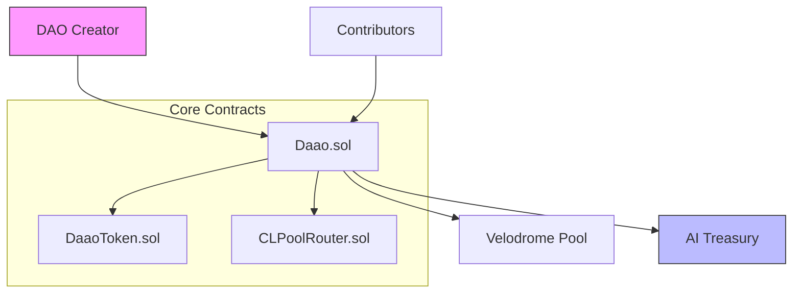
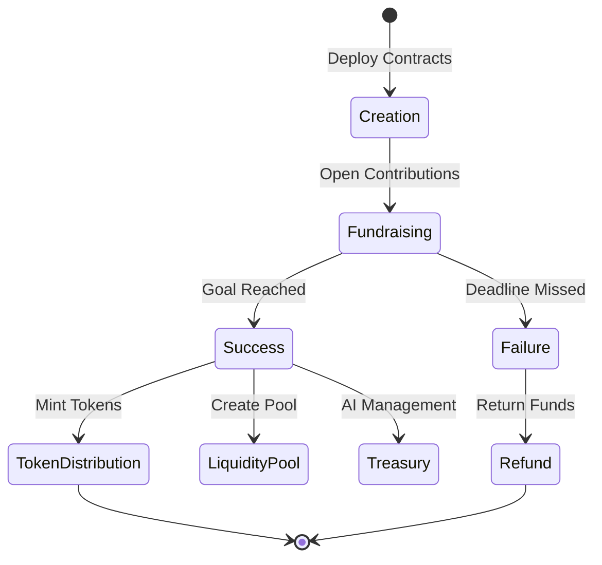
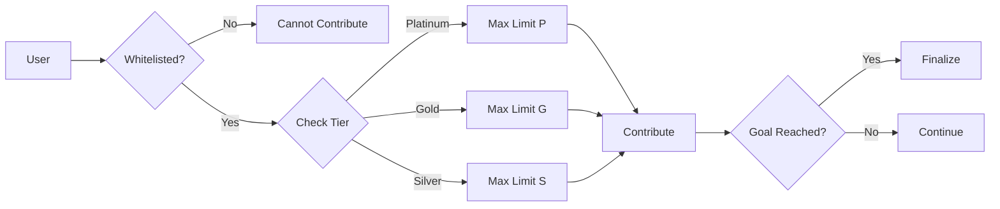

# DaaO (Decentralized AI-augmented Autonomous Organization)

## Installation

```sh
git clone https://github.com/daaoai/daaoai_contracts
cd daaoai_contracts

forge install
```

## Overview

DaaO enables creation of AI-powered DAOs on Mode Network with automated liquidity management via Velodrome-Slipstream integration.

## System Architecture



## DAO Lifecycle



### 1. Creation Phase
The DAO lifecycle begins when an organizer deploys the Daao contract with specific parameters:
```solidity
constructor(
    uint256 _fundraisingGoal,
    string memory _name,
    string memory _symbol,
    uint256 _fundraisingDeadline,
    uint256 _fundExpiry,
    address _daoManager,
    address _liquidityLockerFactory,
    uint256 _maxWhitelistAmount,
    address _protocolAdmin,
    uint256 _maxPublicContributionAmount
)
```

Key initialization parameters:
- Fundraising goal (minimum target)
- Token name and symbol
- Fundraising deadline
- Fund expiry date
- Maximum contribution limits
- Admin addresses

### 2. Whitelist Configuration
- Protocol admin or owner adds contributors to whitelist tiers
- Three distinct tiers with different contribution limits:
  - Platinum: Highest contribution limit
  - Gold: Medium contribution limit
  - Silver: Base contribution limit
- Non-whitelisted addresses cannot contribute if maxWhitelistAmount > 0

### 3. Fundraising Phase
Monitored through key contract variables:
```solidity
uint256 public totalRaised;
uint256 public fundraisingGoal;
bool public fundraisingFinalized;
bool public goalReached;
```

Two possible outcomes:
1. **Success Path**: totalRaised == fundraisingGoal
   - Token distribution triggered
   - Liquidity pool creation
   - AI treasury activation

2. **Failure Path**: deadline reached && totalRaised < fundraisingGoal
   - Refund mechanism activated
   - Contract locked for new contributions

### 4. Token Distribution & Pool Creation
On successful fundraising:
- Tokens minted based on contribution ratio
- 10% of supply allocated to Velodrome-Slipstream pool
- Remaining funds transferred to AI-managed treasury
- Token ownership renounced

## Contribution Process



### 1. Eligibility Verification
```solidity
function contribute() public payable nonReentrant {
    require(!goalReached, "Goal already reached");
    require(block.timestamp < fundraisingDeadline, "Deadline hit");
    require(msg.value > 0, "Contribution must be greater than 0");
}
```

### 2. Contribution Processing
1. **Input Validation**
   - Check contribution amount
   - Verify within tier limits
   - Ensure fundraising active

2. **State Updates**
   - Record contribution
   - Update total raised
   - Track contributor address

3. **Goal Monitoring**
   - Check if goal reached
   - Trigger completion if target met

### 3. Refund Mechanism
Available if fundraising fails:
```solidity
function refund() external nonReentrant {
    require(!goalReached, "Goal was reached");
    require(block.timestamp > fundraisingDeadline, "Deadline not reached");
    require(contributions[msg.sender] > 0, "No contributions");
    
    uint256 amount = contributions[msg.sender];
    contributions[msg.sender] = 0;
    payable(msg.sender).transfer(amount);
}
```

### Security Considerations
- Reentrancy protection on all value transfers
- Contribution limits strictly enforced
- Whitelist validation
- Deadline checks
- Balance verification
- Safe math operations

## Core Features

- **DAO Creation**: Customizable parameters and token economics
- **Tiered Access**: Platinum/Gold/Silver whitelist system
- **Automated Liquidity**: Velodrome-Slipstream integration
- **AI Treasury**: Intelligent fund management

## Technical Stack

### Smart Contracts
- `Daao.sol`: Main DAO logic
- `DaaoToken.sol`: ERC20 implementation
- `CLPoolRouter.sol`: Velodrome integration

### Velodrome-Slipstream Integration
Concentrated liquidity DEX (Uniswap v3 fork) featuring:
- Tick-based pricing
- Custom fee tiers
- Non-fungible positions

## Quick Start

1. Deploy DaaoToken
2. Deploy Daao with parameters
3. Configure whitelist/tiers
4. Start fundraising

## License
MIT License